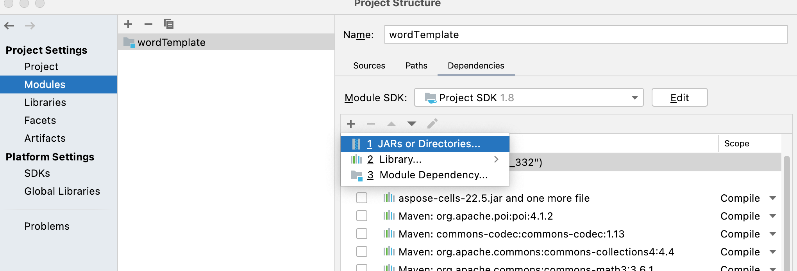

# Word模版解析

## 使用Aspose

[官方文档](https://reference.aspose.com/words/java/com.aspose.words/)

[jar包位置](lib/aspose-words-16.8.0-jdk16.jar)

### 把Aspose添加进项目中（本地环境）

#### 方法一：打进本地maven仓库

1. 执行命令

   ```
   mvn install:install-file -Dfile=jar包绝对路径 -DgroupId=com.aspose -DartifactId=word -Dversion=1.0 -Dpackaging=jar
   ```
2. 添加pom依赖

   ```
   <dependency>
               <groupId>com.aspose</groupId>
               <artifactId>word</artifactId>
               <version>1.0</version>
           </dependency>
   ```

ps:

mvn通用添加进仓库的命令

```
mvn install:install-file -Dfile=/Users/xxx/libs/XXX-1.0.jar -DpomFile=/Users/xxx/libs/pom.xml -DgroupId=org.xxx -DartifactId=xxx -Dversion=1.0 -Dpackaging=jar
```

- -Dfile:文件的所在位置
- -DpomFile:jar包pom文件的所在位置，如果你的jar包中没有pom依赖可省略

#### 方法二：在Project Structure中添加依赖


